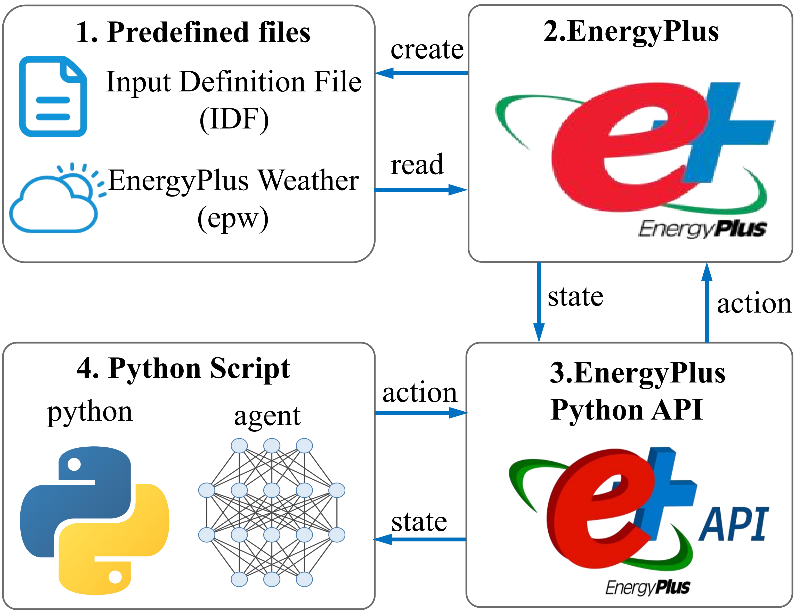

# DCMADRL

This repository contains the implementation of the algorithm proposed in the paper:

**Distributional Constrained Multi-Agent Deep Reinforcement Learning for Multi-Zone HVAC Control**

All codes for the DCMADRL algorithm and related experiments are included.

---

## Environment

| Component         | Version / Requirement |
|------------------|----------------------|
| Operating System | Windows 10 / 11      |
| EnergyPlus       | v23.2                |
| Python           | ≥ 3.11               |

---

## Notes

- The EnergyPlus–Python co-simulation framework is integrated into this repository.
- EnergyPlus (v23.2) is required to run the simulations.

---

## EnergyPlus–Python Co-Simulation Platform

  

This figure illustrates the integrated EnergyPlus–Python co-simulation platform used in this work.
